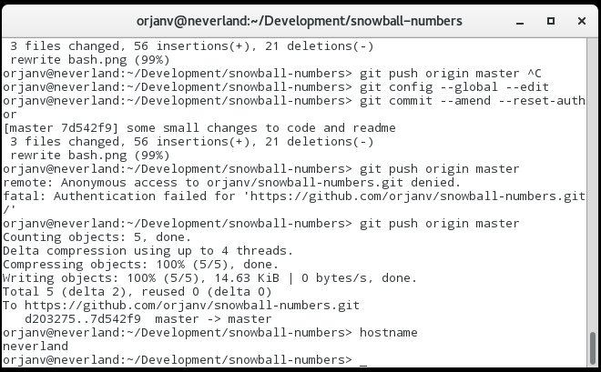

## Finding Snowball Numbers with Python

Inspired by an article at futilitycloset.com (http://www.futilitycloset.com/2014/12/28/snowball-numbers), I wrote a python program to look for such numbers. 

Basically, it takes a number and translates it into its english name and look for letter counts that ends up as a rolling snowball (ie. each letter counts increment by 1). If the current number isn't such a snowball number, the next number is looked at (+1). This is done until you stop the program.


When such a number is found it is recorded to a file called 'snowball_numbers.txt' and sent by email to a given email address.
While running, the program also writes now and then its progress in a file called 'progress.txt'.

Note, this might take a while for two reasons, the program is far from optimized for speed and we need to look a long time for such numbers

### Running the script

You will need ```mailx``` command from the mailutils package found in most linux distributions standard repositories.

You will also need the num2words library, available using pip:

```bash
sudo pip install num2words
```
Run the script as follows:

```python
$ python snowball.py STARTING_NUMBER EMAIL_ADRESS LANGUAGE
```
Where:

NUMBER is your starting point, ex 1 og 1000 or 100000000
EMAIL_ADRESS is your email to be notified at when hitting each 100 millionth run and if a snowballnumber is found.
LANGUAGE is the shortform for any of the supported languages in num2words, eg: no, fr etc. If not set, english is chosen as default.

Examples:

```bash
python snowball.py 1 user@host.com no
python snowball.py 10000 user@host.com fr
```



### EXPERIMENTAL

I have tried to optimize the program to run faster and add some tests to improve the program.

An attempt to save time is currently implemented, but is experimental and might skip real snowball numbers:

```python
# If the last number in the sorted list is far from the amount of digits in list, we might think this is far from a snowball number.
# This is EXPERIMENTAL and might skip actual snowball numbers
if num_list[-1] < (len(num_list) - 5):
	num += 5000
```

Simply comment this out to ignore the experimental test.
